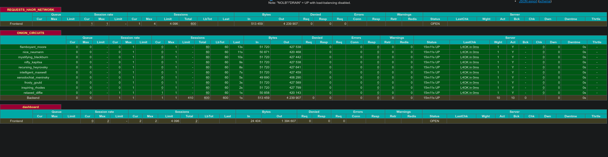

# **requests-whaor** [ri-kwests hawr]

**Requests** **W**ith **H**igh **A**vailability **O**nion **R**outer. For the filthiest web scrapers that have no time for rate-limits.

Requests + Docker + HAproxy + Tor

WORK IN PROGRESS

## Prerequisites
* Docker
* Python ^3.8

## Examples
#### examples/example_one.py

```
from requests_whaor import RequestsWhaor
import requests

URL = "http://jsonip.com/"

with RequestsWhaor(proxy_count=5) as requests_whaor:
    for _ in range(10):
        try:
            resp = requests_whaor.get(URL)

            if resp.ok:
                print(resp.text)

        except Exception as e:
            print(e)

```
#### Results: examples/example_one.py


#### examples/example_three.py

```
from requests_whaor import RequestsWhaor
import requests
from requests.exceptions import ProxyError, Timeout, ConnectionError
from concurrent.futures import as_completed, ProcessPoolExecutor
from collections import Counter

URL = "http://jsonip.com/"

REQUESTS_TO_SEND = 50
PROXY_COUNT = 10
WORKERS = 10


def get_retry_loop(url, proxies, retry=5):
    try:
        response = requests.get(url, proxies=proxies, timeout=5)

        if response.ok:
            print(response.text)
            return "PASSED"

    except (ProxyError, Timeout, ConnectionError) as e:
        print()
        print(e)
        print(f"Will retry ({retry}) more times.")
        print()

    if retry > 0:
        retry -= 1
    else:
        return "FAILED"

    return get_retry_loop(url, proxies, retry=retry)


results = []
with RequestsWhaor(proxy_count=PROXY_COUNT) as requests_whaor:
    with ProcessPoolExecutor(max_workers=WORKERS) as executor:
        futures = [
            executor.submit(get_retry_loop, URL, requests_whaor.rotating_proxy)
            for _ in range(REQUESTS_TO_SEND)
        ]
        for future in as_completed(futures):
            result = future.result()
            results.append(result)
        else:
            print("done.")

print(Counter(results))

```
#### Results: examples/example_three.py


### You may need theses just in case.
```
docker ps -q --filter ancestor=osminogin/tor-simple:latest | xargs -L 1 docker logs --follow
docker stop $(docker ps -q --filter ancestor=osminogin/tor-simple:latest)
docker stop $(docker ps -q --filter ancestor=haproxy:latest)
docker network rm $(docker network ls -q -f name=haornet)
```
### HAProxy Dashboard
The name of each container is shown in the haproxy stat report.



## TODO
* docs
* tests
* clean up main context manger logic.
* publish

## Contact Information
Telegram = Twitter = Tradingview = Discord = @dgnsrekt

Email = dgnsrekt@pm.me
