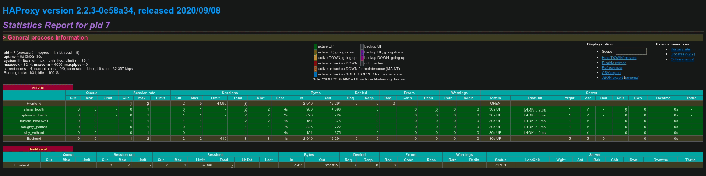

# **Quick Start**

## Prerequisites
* [Docker Engine](https://docs.docker.com/engine/)
* Python ^3.8

## Install with pip
```
pip install requests-whaor
```

## Install with [Poetry](https://python-poetry.org/)
```
poetry add requests-whaor
```

## Use with the [Requests](https://requests.readthedocs.io/en/master/) library
```python
from requests_whaor import RequestsWhaor
import requests

URL = "http://jsonip.com/"

with RequestsWhaor(onion_count=5) as requests_whaor:
    for _ in range(10):
        result = requests.get(URL, proxies=requests_whaor.rotating_proxy)
        print(result.text)
```

## Use with the requests_whaor's internal get method which retries on failure

```python
from requests_whaor import RequestsWhaor

URL = "http://jsonip.com/"

with RequestsWhaor(onion_count=5, max_retries=10) as requests_whaor:
    for _ in range(10):
        result = requests_whaor.get(URL)
        print(result.text)
```

!!! note
    * RequestsWhaor's internal .get() method will retry requests on
        ProxyError, Timeout, ConnectionError and bad response codes.
    * On each retry the request will routed through a new ip address.


## Quickstart Output
[](img/quickstart.gif)

## HAproxy Dashboard
[](img/dashboard.gif)
